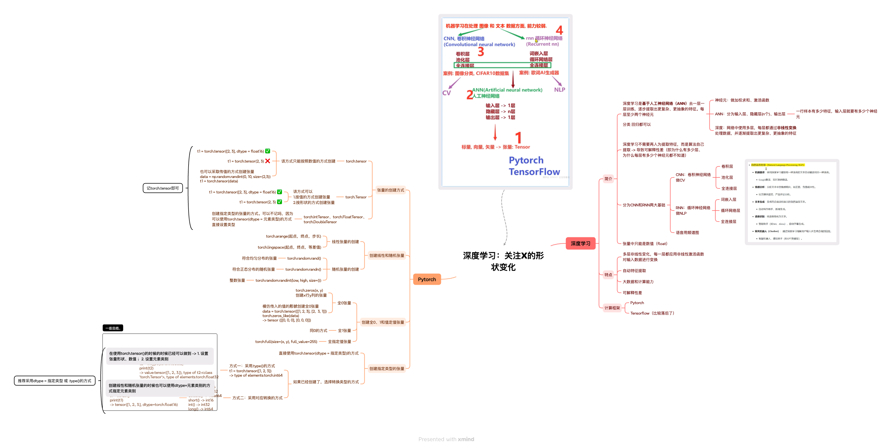

# 🚀 拿捏深度学习 (Mastering Deep Learning) 系列课程

> **"The best material to study Deep Learning - Chinese Version"**
> 这是一个以工程实战为导向的 PyTorch 学习路径。所有核心知识点均通过高质量 Python 代码实现，并配有直观的思维导图。
---
**The English version of this handbook will be released after the completion of the Chinese version handbok.**

---
## 📅 学习路线图 (Roadmap)

我们将按照以下路径深挖 PyTorch 的底层逻辑：

| 阶段 | 核心模块 | 进度 | 重点内容 |
| :--- | :--- | :--- | :--- |
| 🟢 **Phase 1** | **PyTorch 基础操作** | `In Progress` | 张量创建、维度变换、内存机制 |
| 🟡 **Phase 2** | **张量的处理与计算** | `Planned` | 数学运算、广播机制、切片索取 |
| 🟠 **Phase 3** | **神经网络基础** | `Planned` | 激活函数、反向传播、Autograd |
| 🔴 **Phase 4** | **损失函数与优化** | `Planned` | SGD, Adam, CrossEntropy |
| 🟣 **Phase 5** | **核心架构 (CNN & RNN)** | `Planned` | 卷积核、池化、时间序列处理 |

---

## 🧠 思维导图 (Mind Map)

> 💡 **提示**：建议结合代码与导图同步学习。

---

## 📂 已完成模块预览

### 01_PyTorch_Study
* **[Tensor_张量的基础创建和元素类型.py](./01_PyTorch_Study/Tensor_张量的基础创建和元素类型.py)**
    * ✅ 三种基础创建方式对比 (`torch.tensor` vs `torch.Tensor`)
    * ✅ 全0/1/指定值张量的初始化
    * ✅ 线性与随机张量的生成逻辑
    * ✅ 显式数据类型控制 (`dtype` & `.type()`)

---

## 🛠️ 环境要求
* Python 3.8+
* PyTorch 2.0+
* NumPy
* Pandas
---

**持续更新中，欢迎 Star ⭐️ 关注我的进步！**
---
